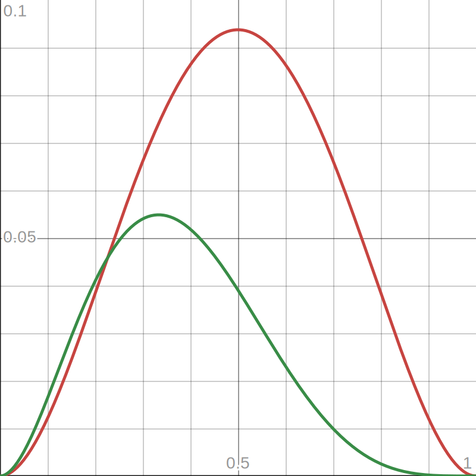
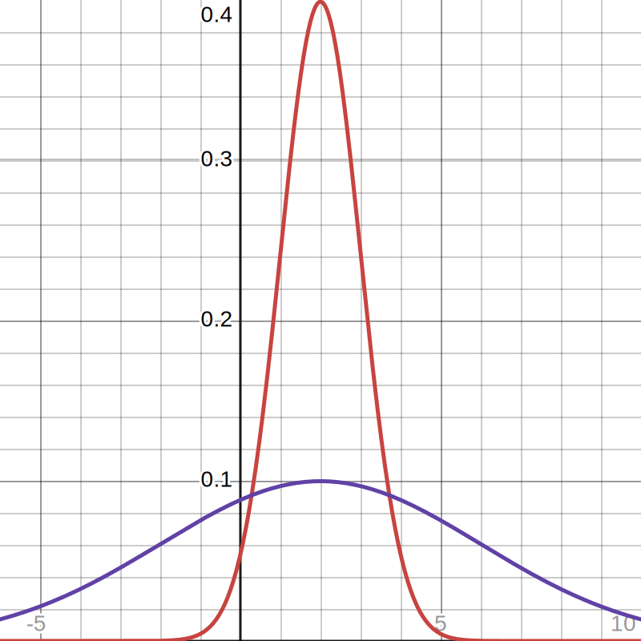
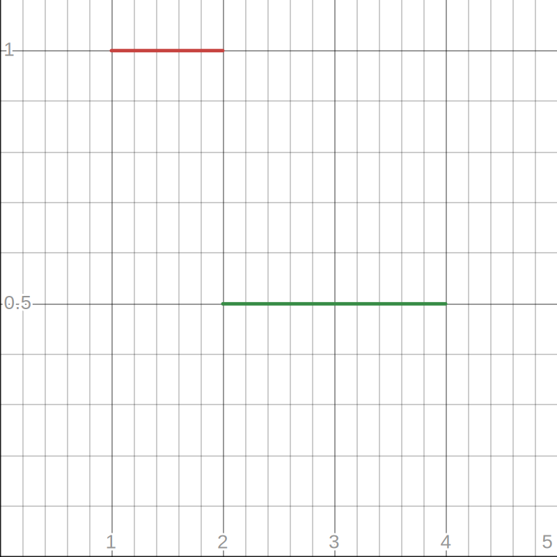
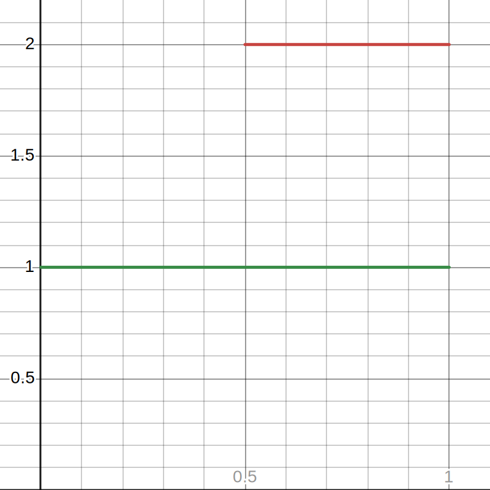
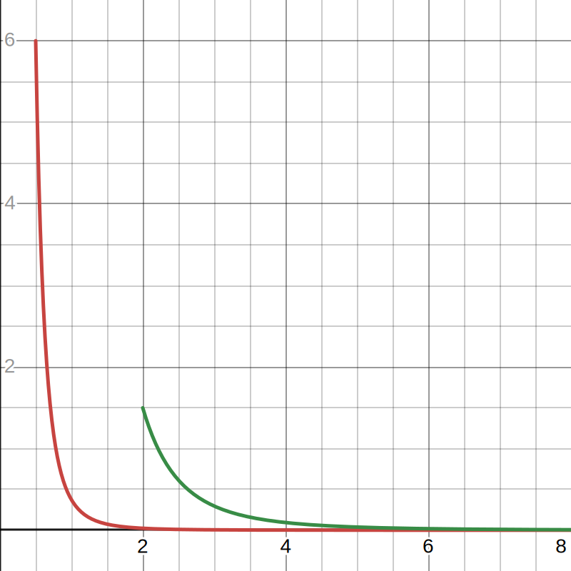

# 1
#### (a)

As $\theta$ increased, the height of the curve decreased.

#### (b)
$$L(\theta) = \prod_{i = 1}^n \frac{\theta + 1}{2} X_i^2 (1 - X_i)^\theta$$
$$l(\theta) = ln\left(\prod_{i = 1}^n \frac{\theta + 1}{2} X_i^2 (1 - X_i)^\theta\right)$$
$$l(\theta) = \sum_{i = 1}^n ln\left(\frac{\theta + 1}{2} X_i^2 (1 - X_i)^\theta\right)$$
$$l(\theta) = \sum_{i = 1}^n \left( ln\left(\frac{\theta + 1}{2}\right) + ln\left(X_i^2\right) + ln\left((1 - X_i)^\theta\right)\right)$$
$$l(\theta) = \sum_{i = 1}^n \left(ln\left(\frac{\theta + 1}{2}\right) + 2\ ln\left(X_i\right) + \theta\ ln\left(1 - X_i\right)\right)$$
$$l(\theta) = n\ ln\left(\frac{\theta + 1}{2}\right) +  2 \sum_{i = 1}^n ln\left(X_i\right) + \theta \sum_{i = 1}^n ln\left(1 - X_i\right)$$
$$\frac{\delta l(\theta)}{\delta \theta} = \frac{n}{\theta + 1} + \sum_{i = 1}^n ln(1-X_i) = 0$$
$$\hat\theta_{MLE} = \frac{-n}{\sum_{i=1}^n ln(1-X_i)} - 1$$

#### (c)
$$\hat\eta_{MLE} = \sqrt{\hat\theta_{MLE} + 1}$$

\pagebreak
# 2
#### (a)

As $\xi$ increased, the height of the curve decreased.

#### (b)
$$L(\xi) = \prod_{i = 1}^n \frac{1}{\sqrt{2\pi}\xi}exp\left(-\frac{1}{2}\left(\frac{X_i-2}{\xi}\right)^2\right)$$
$$l(\xi) = ln\left(\prod_{i = 1}^n \frac{1}{\sqrt{2\pi}\xi}exp\left(-\frac{1}{2}\left(\frac{X_i-2}{\xi}\right)^2\right)\right)$$
$$l(\xi) = \sum_{i = 1}^n \left(ln\left(\frac{1}{\sqrt{2\pi}\xi}\right) -\frac{1}{2}\left(\frac{X_i-2}{\xi}\right)^2\right)$$
$$l(\xi) = -n\ ln\left(\sqrt{2\pi}\xi\right) - \frac{1}{2} \sum_{i = 1}^n \left(\frac{X_i-2}{\xi}\right)^2$$
$$l(\xi) = -n\ ln \sqrt{2\pi} -n\ ln\ \xi - \frac{1}{2} \sum_{i = 1}^n \left(\frac{X_i-2}{\xi}\right)^2$$
$$\frac{\delta l(\xi)}{\delta\xi} = - \frac{n}{\xi} + \sum_{i = 1}^n \frac{(X_i - 2)^2}{\xi^3} = 0$$
$$\frac{1}{\xi^3} \sum_{i = 1}^n (X_i - 2)^2 = \frac{n}{\xi}$$
$$\sum_{i = 1}^n (X_i - 2)^2 = n\xi^2$$
$$\hat\xi_{MLE} = \sqrt{\frac{1}{n} \sum_{i = 1}^n (X_i - 2)^2}$$

#### (c)
$$\hat\alpha_{MLE} = log(\hat\xi_{MLE})$$

\pagebreak
# 3
#### (a)

As $\beta$ increases, the line is lower but is also longer.

#### (b)
$$L(\beta) = \begin{cases} 
\left(\frac{1}{\beta}\right)^n & \text{if } \beta < min(X_i) \text{ and } max(X_i) < 2\beta \\
0 & \text{otherwise}
\end{cases}$$

$$\frac{max(X_i)}{2} < \beta < min(X_i)$$

We know that $L(\beta)$ is monotonic. To maximize $L(\beta)$, we want to minimize $\beta$.

$$\hat\beta_{MLE} = \begin{cases}
\frac{max(X_i)}{2} & \text{if } \frac{max(X_i)}{2} < min(X_i) \\
DNE & \text{otherwise}
\end{cases}$$

\pagebreak
# 4
#### (a)

As $\theta$ increases, the line is higher and also shorter.

#### (b)
$$L(\theta) = \begin{cases}
\frac{1}{1-\theta} & \text{if } \theta < min(X_i) \text{ and } max(X_i) < 1 \\
0 & \text{otherwise}
\end{cases}$$

To maximize $L(\theta)$, we want $\theta$ to be as close to 1 as possible.

$$\hat\theta_{MLE} = \begin{cases}
min(X_i) & \text{if } max(X_i) < 1 \\
DNE & \text{otherwise}
\end{cases}$$

\pagebreak
# 5
#### (a)

As $\sigma$ increases, the graph starts more towards the right and is higher.

#### (b)
$$F(x) = \int_{-\infty}^x \frac{3\sigma^3}{z^4}\ dz$$
$$F(x) = \int_{\sigma}^x \frac{3\sigma^3}{z^4}\ dz$$
$$F(x) = 3\sigma^3 \int_{\sigma}^x \frac{1}{z^4}\ dz$$
$$F(x) = \left[ 3\sigma^3 * \frac{-1}{3z^3} \right]_\sigma^x$$
$$F(x) = \left[\frac{-\sigma^3}{z^3} \right]_\sigma^x$$
$$F(x) = \frac{-\sigma^3}{x^3} + 1$$
$$F(x) = \begin{cases}
1 - \frac{\sigma^3}{x^3} & \text{if } x > \sigma \\
0 & \text{otherwise}
\end{cases}
$$

#### (c)
$$E[X_1] = \int_\sigma^\infty x\ \frac{3\sigma^3}{x^4}\ dx = \int_\sigma^\infty \frac{3\sigma^3}{x^3}\ dx$$
$$E[X_1] = 3\sigma^3 \int_\sigma^\infty \frac{1}{x^3}\ dx$$
$$E[X_1] = 3\sigma^3 \left[\frac{-1}{2x^2}\right]_\sigma^\infty$$
$$E[X_1] = \frac{3\sigma^3}{2\sigma^2}$$
$$E[X_1] = \frac{3\sigma}{2}$$

#### (d)
$$L(\sigma) = \begin{cases}
\prod_{i=1}^n \frac{3\sigma^3}{X_i^4} & \text{if } min(X_i) > \sigma \\
0 & \text{otherwise}
\end{cases}$$

To maximize $L(\sigma)$, we want to maximize $\sigma$.

$$\hat\sigma_{MLE} = min(X_i)$$

\pagebreak
# 6
$$\pi_2 = 4 \pi_1$$
$$\pi_1 + \pi_2 + \pi_3 = 1$$
$$(\hat\pi_1)_{MLE} =\ ?$$
$$\pi_3 = 1 - \pi_2 - \pi_1$$
$$\pi_3 = 1 - 4\pi_1 - \pi_1$$
$$\pi_3 = 1 - 5\pi_1$$

$$L(\pi) = \pi_1^{Y_1} \pi_2^{Y_2} \pi_3^{Y_3}$$
$$L(\pi) = \pi_1^{Y_1} (4\pi_1)^{Y_2} (1-5\pi_1)^{Y_3}$$
$$l(\pi) = log(\pi_1^{Y_1}) + log((4\pi_1)^{Y_2}) + log((1-5\pi_1)^{Y_3})$$
$$l(\pi) = Y_1log(\pi_1) + Y_2log(4\pi_1) + Y_3log(1-5\pi_1)$$
$$l(\pi) = Y_1log(\pi_1) + Y_2log(4) + Y_2log(\pi_1) + Y_3log(1-5\pi_1)$$
$$l(\pi) = (Y_1 + Y_2)log(\pi_1) + Y_3log(1-5\pi_1) + Y_2log(4)$$
$$\frac{\delta l(\pi)}{\delta\pi} = \frac{Y_1 + Y_2}{\pi_1} - \frac{5Y_3}{1-5\pi_1} = 0$$
$$\frac{Y_1 + Y_2}{\pi_1} = \frac{5Y_3}{1-5\pi_1}$$
$$(Y_1 + Y_2)(1-5\pi_1) = 5Y_3\pi_1$$
$$Y_1 + Y_2 - 5\pi_1Y_1 - 5\pi_1Y_2 = 5Y_3\pi_1$$
$$Y_1 + Y_2 = \pi_1 * 5 (Y_1 + Y_2 + Y_3)$$
$$(\hat\pi_1)_{MLE} = \frac{Y_1 + Y_2}{5 (Y_1 + Y_2 + Y_3)} = \frac{Y_1 + Y_2}{5n}$$

\pagebreak
# 7
$$\pi_2 = 2\pi_1$$
$$\pi_4 = 3\pi_1$$
$$\pi_1 + \pi_2 + \pi_3 + \pi_4 = 1$$
$$L(\pi_1) = \pi_1^{Y_1} \pi_2^{Y_2} \pi_3^{Y_3} \pi_4^{Y_4}$$

#### (a)
$$(\hat\pi_1)_{MLE} =\ ?$$
$$\pi_3 = 1 - \pi_4 - \pi_2 - \pi_1$$
$$\pi_3 = 1 - 3\pi_1 - 2\pi_1 - \pi_1$$
$$\pi_3 = 1 - 6\pi_1$$
$$L(\pi_1) = \pi_1^{Y_1} (2\pi_1)^{Y_2} (1 - 6\pi_1)^{Y_3} (3\pi_1)^{Y_4}$$
$$l(\pi_1) = Y_1log(\pi_1) + Y_2log(2\pi_1) + Y_3log(1 - 6\pi_1) + Y_4log(3\pi_1)$$
$$l(\pi_1) = (Y_1 + Y_2 + Y_4)log(\pi_1) + Y_2log(2) + Y_3log(1 - 6\pi_1) + Y_4log(3)$$
$$\frac{\delta l(\pi_1)}{\delta \pi_1} = \frac{Y_1 + Y_2 + Y_4}{\pi_1} - \frac{6Y_3}{1 - 6\pi_1} = 0$$
$$\frac{Y_1 + Y_2 + Y_4}{\pi_1} = \frac{6Y_3}{1 - 6\pi_1}$$
$$(Y_1 + Y_2 + Y_4)(1 - 6\pi_1) = 6Y_3\pi_1$$
$$Y_1 + Y_2 + Y_4 = 6n\pi_1$$
$$(\hat\pi_1)_{MLE} = \frac{Y_1 + Y_2 + Y_4}{6n}$$

#### (b)
$$(\hat\pi_3)_{MLE} =\ ?$$
$$\pi_1 = \frac{1 - \pi_3}{6}$$
$$\pi_2 = \frac{1 - \pi_3}{3}$$
$$\pi_4 = \frac{1 - \pi_3}{2}$$

$$L(\pi_3) = \left(\frac{1 - \pi_3}{6}\right)^{Y_1} \left(\frac{1 - \pi_3}{3}\right)^{Y_2} \pi_3^{Y_3} \left(\frac{1 - \pi_3}{2}\right)^{Y_4}$$
$$l(\pi_3) = Y_1\ log\left(\frac{1 - \pi_3}{6}\right) + Y_2\ log\left(\frac{1 - \pi_3}{3}\right) + Y_3\ log(\pi_3) + Y_4\ log\left(\frac{1 - \pi_3}{2}\right)$$
$$l(\pi_3) = (Y_1 + Y_2 + Y_4)\ log\left(1 - \pi_3\right) + Y_3\ log(\pi_3) - Y_1\ log(6) - Y_2\ log(3) - Y_4\ log(2)$$
$$\frac{\delta l(\pi_3)}{\delta \pi_3} = \frac{-(Y_1 + Y_2 + Y_4)}{1 - \pi_3} + \frac{Y_3}{\pi_3} = 0$$
$$\frac{Y_3}{\pi_3} = \frac{Y_1 + Y_2 + Y_4}{1 - \pi_3}$$
$$Y_3(1 - \pi_3) = (Y_1 + Y_2 + Y_4)\pi_3$$
$$Y_3 = (Y_1 + Y_2 + Y_3 + Y_4)\pi_3$$
$$(\hat\pi_3)_{MLE} = \frac{Y_3}{n}$$

\pagebreak
# 8
$$L(\theta) = \begin{cases}
\frac{1}{\theta^{27}} & \text{if } max(X_i) \leq \theta \\
0 & \text{otherwise}
\end{cases}$$

$$max(X_i) = max(9.2, 3) = 9.2$$

To maximize $L(\theta)$, we want to minimize $\theta$.

$$\hat\theta_{MLE} = 9.2$$