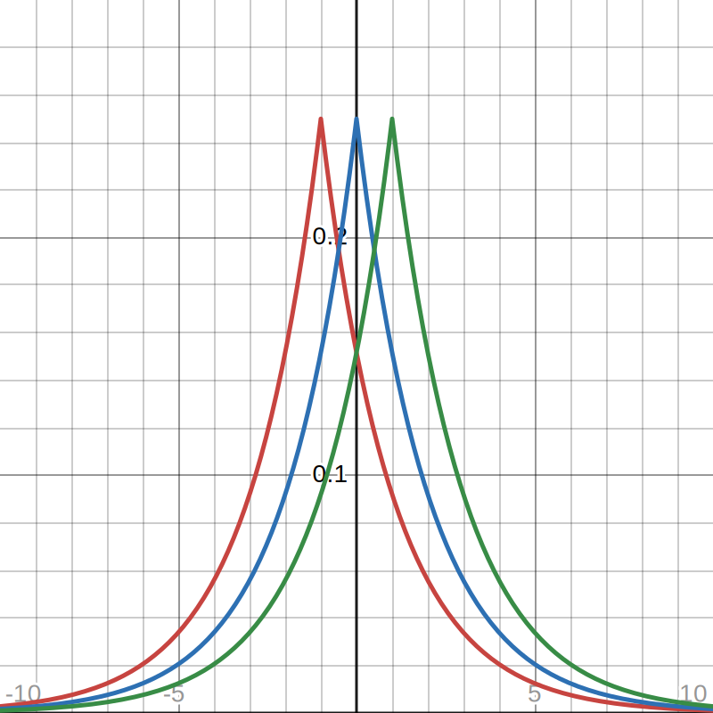
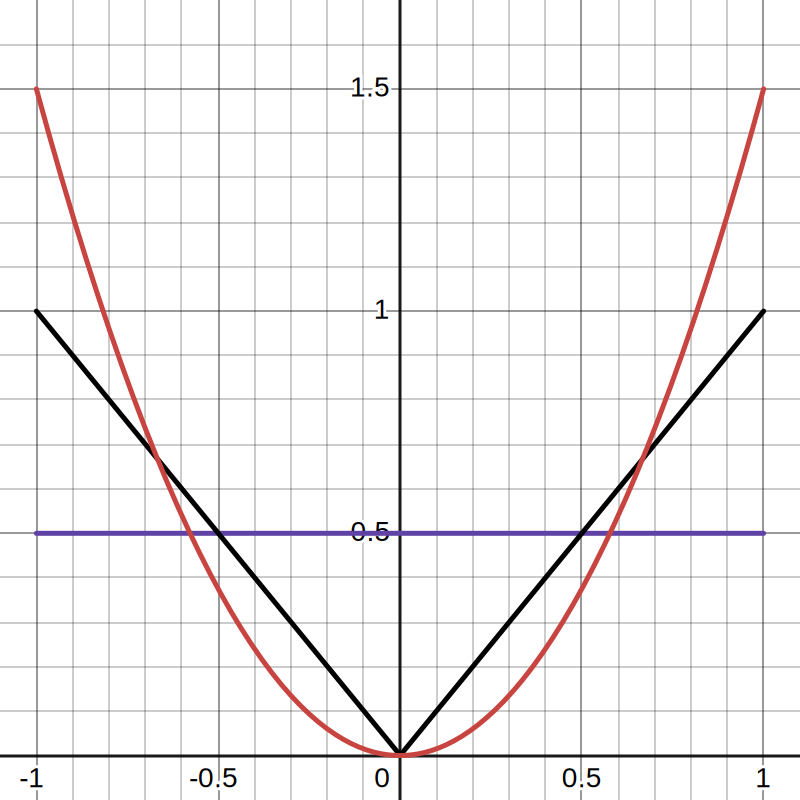

# 1
#### (a)

It looks like a normal distribution with inverted concavity. As we increase $\mu$, it shifts right on the x-axis.

#### (b)
$$L(\mu; x) = \prod_{i = 1}^n \frac{1}{4}exp\left(-\frac{|x_i - \mu|}{2}\right)$$

$$l(\mu; x) = \sum_{i = 1}^n \left(log\left(\frac{1}{4}\right) - \frac{|x_i - \mu|}{2}\right)$$

The function is not differentiable over the range of possible parameters when $x = \mu$.

#### (c)
To maximize $l$, we want to minimize:

$$\sum_{i = 1}^n |x_i - \mu|$$

We can minimize this by selecting the following:

$$\hat\mu_{mle} = median(x_1, ..., x_n)$$

\newpage
# 2
#### (a)

As we increase $\lambda$ from $\lambda = 1$, the concavity gets steeper. The graph also reflects over the y-axis.

#### (b)
$$L(\lambda; x) = \prod_{i = 1}^n \frac{\lambda}{2}|x_i|^{\lambda - 1}$$

$$L(\lambda; x) = \left(\frac{\lambda}{2}\right)^n \prod_{i = 1}^n |x_i|^{\lambda - 1}$$

$$l(\lambda; x) = n\ log\left(\frac{\lambda}{2}\right) + \sum_{i = 1}^n (\lambda - 1)log|x_i|$$

$$l(\lambda; x) = n\ log\left(\frac{\lambda}{2}\right) + (\lambda - 1) \sum_{i = 1}^n log|x_i|$$

Function is differentiable over the range of all parameters.

#### (c)
$$\frac{\delta l(\lambda; x)}{\delta \lambda} = \frac{\frac{1}{2}}{\frac{\lambda}{2}}n + \sum_{i = 1}^n log|x_i|$$

$$\frac{\delta l(\lambda; x)}{\delta \lambda} = \frac{n}{\lambda} + \sum_{i = 1}^n log|x_i| = 0$$

$$\sum_{i = 1}^n log|x_i| = -\frac{n}{\lambda}$$
$$\hat\lambda_{mle} = -\frac{n}{\sum_{i = 1}^n log|x_i|}$$

#### (d)
$$log(f(\lambda; X)) = log(\lambda) - log(2) + (\lambda - 1)log|X|$$

$$\frac{\delta log(f(\lambda; X))}{\delta \lambda} = \frac{1}{\lambda} + log|X|$$

$$\frac{\delta^2 log(f(\lambda; X))}{\delta \lambda^2} = - \frac{1}{\lambda^2}$$

$$I(\lambda) = -E\left[ - \frac{1}{\lambda^2}\right]$$

$$I(\lambda) = \frac{1}{\lambda^2}$$

#### (e)
$$\sqrt n(\hat\lambda_{mle} - \lambda) \xrightarrow{d} N\left(0, \lambda^2 \right)$$

\newpage
# 3
#### (a)
$$L(\theta; x) = \prod_{i = 1}^n (x_i + 1) \theta^2 (1 - \theta)^{x_i}$$

$$L(\theta; x) = \theta^{2n} \prod_{i = 1}^n (x_i + 1) (1 - \theta)^{x_i}$$

$$l(\theta; x) = 2n\ log(\theta) + \sum_{i = 1}^n (log(x_i + 1) + x_i\ log(1 - \theta))$$

$$\frac{\delta l(\theta; x)}{\delta \theta} = \frac{2n}{\theta} + \sum_{i = 1}^n \frac{-x_i}{1 - \theta} = 0$$

$$\frac{2n}{\theta} = \sum_{i = 1}^n \frac{x_i}{1 - \theta}$$

$$2n(1 - \theta) = \theta \sum_{i = 1}^n x_i$$

$$2n = 2n\theta + \theta \sum_{i = 1}^n x_i$$

$$2n = \left(2n + \sum_{i = 1}^n x_i\right)\theta$$

$$\hat\theta_{mle} = \frac{2n}{2n + \sum_{i = 1}^n x_i}$$

$$\hat\theta_{mle} = \frac{2}{2 + \bar X}$$

#### (b)
$$log(f(\theta; X)) = log(X + 1) + 2\ log(\theta) + X\ log(1 - \theta)$$

$$\frac{\delta log(f(\theta; X))}{\delta\theta} = \frac{2}{\theta} - \frac{X}{1-\theta}$$

$$\frac{\delta^2 log(f(\theta; X))}{\delta\theta^2} = - \frac{2}{\theta^2} - \frac{X}{(1-\theta)^2}$$

$$I(\theta) = -E\left[- \frac{2}{\theta^2} - \frac{X}{(1-\theta)^2}\right]$$

$$I(\theta) = E\left[\frac{2}{\theta^2} + \frac{X}{(1-\theta)^2}\right]$$

$$I(\theta) = \frac{2}{\theta^2} + \frac{2*\frac{1-\theta}{\theta}}{(1-\theta)^2}$$

$$I(\theta) = \frac{2}{\theta^2} + \frac{2(1-\theta)}{\theta(1-\theta)^2}$$

$$I(\theta) = \frac{2}{\theta^2} + \frac{2}{\theta(1-\theta)}$$

$$I(\theta) = \frac{2(1-\theta)}{\theta^2(1-\theta)} + \frac{2\theta}{\theta^2(1-\theta)}$$

$$I(\theta) = \frac{2}{\theta^2(1-\theta)}$$

#### (c)
$$\sqrt n (\hat \theta_{mle} - \theta) \xrightarrow{d} N\left(0,\ \frac{\theta^2(1-\theta)}{2}\right)$$
